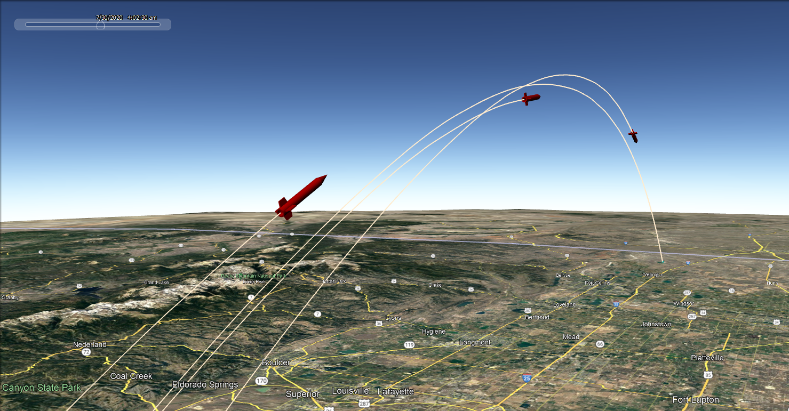
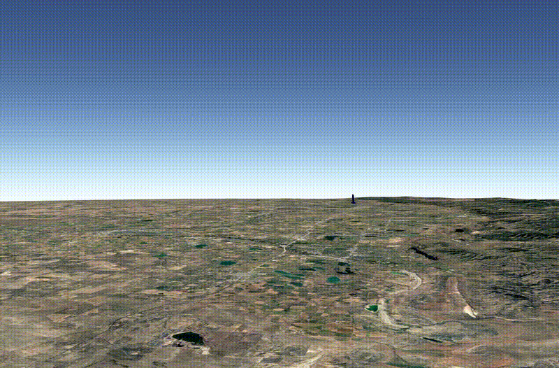
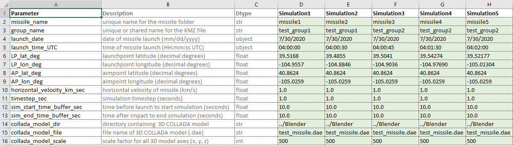
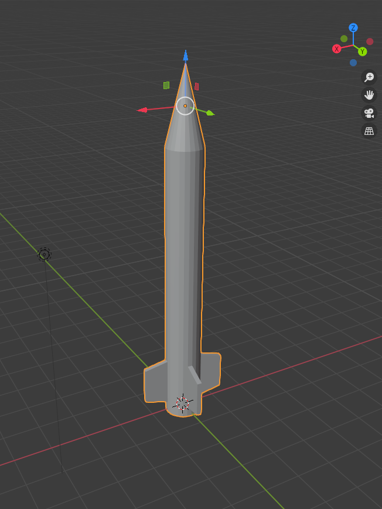

# A Probabilistic Missile Intercept Model

The primary goals for this project are to:

1) Develop a simplified missile intercept model and simulate the model in Google Earth

2) Investigate methods for predicting a missile's trajectory under various levels of 
uncertainty about the missile's launchpoint, intended target, current position, velocity, etc.

 

  

  

## Getting Started

### Setting Up the Virtual Environment

The [environment.yml](docs/env/environment.yml) file contains all of the packages needed to run the code in this repository:

1. Open an Anaconda Prompt
2. Create a new virtual environment: `conda env create -f docs/env/environment.yml`
3. Activate the virtual environment: `conda activate missile_env`

### Docker Container

Alternatively, you can run the code in a Docker container:

1. Build the Docker image from Dockerfile: `docker build -t missile_env .`
2. Run the Docker image in interactive mode: `docker run -it missile_env`

If you want to make modifications (e.g., to code, KML files) that persist outside of the container:

1. Use the docker-compose file to build the image: `docker-compose up --build`
2. Run the Docker image in interactive mode: `docker-compose run --rm missile_env`

### Setting Model Parameters

All configuration parameters are set via the [Config](config/config.xlsx) file. 

Note that there are two tabs: `ballistic` and `interceptor`. 

Parameter descriptions, formats, and datatypes are specified in each tab.

  

Additional simulations can be created by adding new columns to the right of the existing simulations.

### Running the Model

To run the missile intercept model:

1. Set the [Config](config/config.xlsx) file parameters
2. Open Anaconda prompt OR run Docker image AND and activate the `missile_env` virtual environment (see instructions above)
3. Run `python src/main.py`
4. View the resulting KML files (in the `kml` folder) in [Google Earth](https://earth.google.com/web/)

## Methodology

All time variables are specified in seconds.

### Ballistic Missile

* User specifies the latitude and longitude of the missile launchpoint (LP) and aimpoint (AP) and the missile's constant horizontal velocity (km/s), which are used to calculate the [great-circle distance](https://en.wikipedia.org/wiki/Haversine_formula) to the target (km) and total time-to-target.
* The apogee of the ballistic trajectory is reached when the missile is halfway to the target (i.e., 0.5 * total time-to-target).
* The time-to-apogee is multiplied by the absolute value of the gravitational acceleration (km/s^2) to determine the missile's initial vertical velocity (km/s).
* Integrating the vertical velocity equation, the missile's altitude (km) at timestep *t* is calculated as `alt_km(t) = initial_vertical_velocity * t + 0.5 * gravitational_acceleration * t^2`.

### Terminal Phase Interceptor

* User specifies the latitude and longitude of the interceptor launchpoint (LP); the interceptor's constant horizontal velocity (km/s); the name of the missile to intercept; and the desired distance away from the target (km) at which to intercept the missile. That information is used to calculate the intercept position (latitude, longitude, and altitude (km)) and time relative to the ballistic missile launch.
* The ground distance between the interceptor LP and the intercept position is divided by the interceptor constant horizontal velocity (km/s) to determine the intercept time relative to the interceptor launch, which is used to calculate the initial launch velocity (km/s) and launch angle required to counteract gravity.
* The interceptor launch time is calculated as `targeted_missile_launch_time + intercept_time_relative_to_missile_launch - intercept_time_relative_to_interceptor_launch`.

### Limitations 

The plan is to add complexity to the model over time. Currently, the model does not take into account any of the following:

- Aerodynamic drag
- Propulsive thrust
- Changes in missile mass (e.g., after burning fuel)
- Rotation of the Earth

## COLLADA Models

The 3D missile objects displayed in Google Earth are specified as COLLADA (.dae) files. The easiest way to create your own COLLADA file is through [Blender](https://www.blender.org/). 

The missile object created in Blender should be oriented such that the nose cone is parallel to and points in the direction of the positive z-axis (in a right-handed coordinate system), with the base of the missile sitting on the plane created by the x and y-axes (in other words, the missile should appear as though it were standing upright and centered on the launch pad).

Example orientation:

  

## Sources

- Trajectory Equations
  - [NASA Glenn Research Center](https://www1.grc.nasa.gov/beginners-guide-to-aeronautics/ballistic-flight-equations/)
  - [University of Florida Department of Mechanical & Aerospace Engineering](https://mae.ufl.edu/~uhk/ICBM.pdf)
  - [MIT Department of Aeronautics and Astronautics](https://web.mit.edu/16.unified/www/FALL/systems/Lab_Notes/traj.pdf)

- Geodetic Equations
  - Chris Veness, Movable-Type Scripts ([Spherical Trigonometry](https://www.movable-type.co.uk/scripts/latlong.html) and [Vector-Based Methods](https://www.movable-type.co.uk/scripts/latlong-vectors.html))

- Creating 3D Models in COLLADA Format
  - [Blender](https://www.blender.org/)
