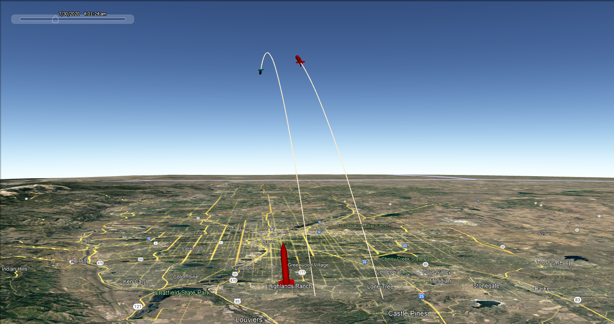

# Missile Intercept Model

Project goals:

1) Develop a simplified missile intercept model and simulate the model in Google Earth

2) Investigate methods for predicting the trajectory of a missile under various levels of 
uncertainty about the missile's launchpoint, intended target, and velocity

Example 1:

  

Example 2:

  

# Getting Started

## Setting Up a Conda Virtual Environment

The [environment.yml](docs/env/environment.yml) file contains all of the packages needed to run the code in this repository.

To create a new Conda virtual environment with the required packages:

1. Open an Anaconda Prompt

2. Create a new virtual environment: `conda env create -f environment.yml`

3. Activate the virtual environment: `conda activate missile_env`

### Methodology

The plan is to start by developing a simplified model and then to build on that model over time. The first model iteration
does not take into account any of the following (for either the ballistic or interceptor missiles):

- Aerodynamic drag
- Propulsive thrust
- Changes in missile mass (e.g., after burning fuel)
- Rotation of the Earth
- Uncertainty in ballistic missile trajectory

### Sources

- Trajectory Equations
  - [University of Florida Department of Mechanical & Aerospace Engineering](https://mae.ufl.edu/~uhk/ICBM.pdf)
  - [MIT Department of Aeronautics and Astronautics](https://web.mit.edu/16.unified/www/FALL/systems/Lab_Notes/traj.pdf)
  - [NASA Glenn Research Center](https://www.grc.nasa.gov/www/k-12/airplane/ballflght.html)

- Geodetic Equations
  - Chris Veness, Movable-Type Scripts ([Spherical Trigonometry](https://www.movable-type.co.uk/scripts/latlong.html) and [Vector-Based Methods](https://www.movable-type.co.uk/scripts/latlong-vectors.html))

- Creating 3D Models in COLLADA Format
  - [Blender](https://www.blender.org/)
